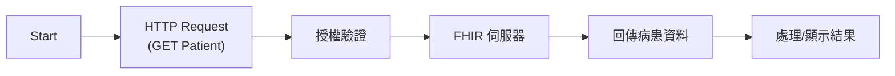
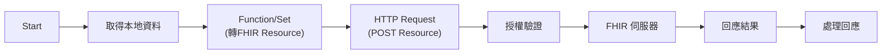
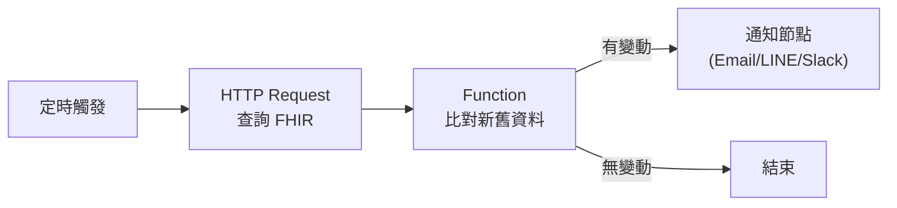

# n8n 與 FHIR 的實例應用

> 本章所有範例皆以台灣公開 FHIR 伺服器 [https://twcore.hapi.fhir.tw/fhir/](https://twcore.hapi.fhir.tw/fhir/) 為例。

本章將介紹如何利用 n8n 平台與 FHIR（Fast Healthcare Interoperability Resources）標準進行醫療資料的整合與自動化，並透過實際案例說明 n8n 在醫療資訊互通上的應用潛力。

## 章節內容

- FHIR 標準簡介與醫療資料互通的重要性
- n8n 如何串接 FHIR API
- 實作範例：
    - 取得病患基本資料（Patient Resource）
    - 自動同步醫療紀錄到 FHIR 伺服器
    - 監控 FHIR 資源變動並自動通知
- 常見問題與實務建議

## 學習重點

- 了解 FHIR 標準的基本概念與結構
- 學會在 n8n 中串接並操作 FHIR API
- 能夠設計簡單的醫療資料自動化流程

---

> 本章將以實作為主，帶領讀者從 n8n 節點設定到 FHIR API 呼叫，逐步完成醫療資料自動化的實例應用。 

## FHIR 實作範例

### 範例一：取得病患基本資料（Patient Resource）

**目標**：從 FHIR 伺服器查詢特定病患的基本資料。

**流程圖：**


**n8n 節點設計**：
1. 使用 HTTP Request 節點，設定方法為 GET。
2. 輸入 FHIR 伺服器的 Patient API 路徑，例如：`https://twcore.hapi.fhir.tw/fhir/Patient/pat-nsysu-hd-001`。
3. 設定授權（此伺服器為公開測試環境，通常不需授權）。
4. 取得回應後，可用 Set/Function 節點處理資料。

**查詢結果重點欄位範例**：
```json
{
  "resourceType": "Patient",
  "id": "pat-nsysu-hd-001",
  "name": [ { "text": "pt" } ],
  "gender": "male",
  "birthDate": "2005",
  "telecom": [ { "system": "phone", "value": "0968998864" } ]
}
```

**步驟簡述**：
- 新增 HTTP Request 節點，填入 `https://twcore.hapi.fhir.tw/fhir/Patient/pat-nsysu-hd-001`。
- 執行流程，取得並顯示病患基本資料（如姓名、性別、出生年、電話等）。

### 範例二：自動同步醫療紀錄到 FHIR 伺服器

**目標**：將本地醫療系統產生的病患紀錄（如 Observation、Encounter）自動上傳到 FHIR 伺服器。

**流程圖：**


**n8n 節點設計**：
1. 使用資料來源節點（如 MySQL、Postgres、Webhook 等）取得本地資料。
2. 用 Function/Set 節點將資料轉換為 FHIR Resource 格式（JSON）。
3. 使用 HTTP Request 節點，設定方法為 POST，目標為 FHIR Resource API（如 `https://twcore.hapi.fhir.tw/fhir/Observation`）。
4. 設定 Content-Type: application/fhir+json。

**步驟簡述**：
- 取得本地醫療資料。
- 轉換為 FHIR Resource 格式。
- 透過 HTTP POST 上傳到 FHIR 伺服器。

### 範例三：監控 FHIR 資源變動並自動通知

**目標**：當 FHIR 伺服器上的特定資源（如 Appointment）有新增或變動時，自動發送通知（如 Email、LINE）。

**流程圖：**


**n8n 節點設計**：
1. 使用定時觸發器（Cron 節點）定期查詢 FHIR API。
2. HTTP Request 節點查詢最新資源（可用 _lastUpdated 參數過濾）。
3. 用 Function 節點比對資料是否有變動。
4. 若有變動，觸發通知節點（如 Email、LINE、Slack）。

**步驟簡述**：
- 設定定時查詢 FHIR API。
- 比對新舊資料。
- 有變動時自動發送通知。

---

這三個範例涵蓋了 FHIR 與 n8n 整合的常見應用情境，讀者可依需求進一步擴充流程或串接更多醫療資訊系統。 